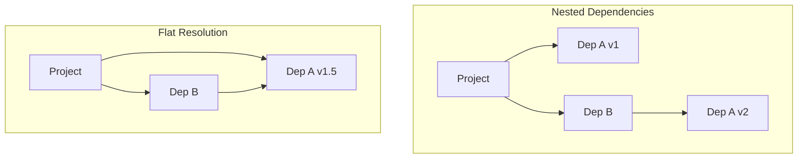
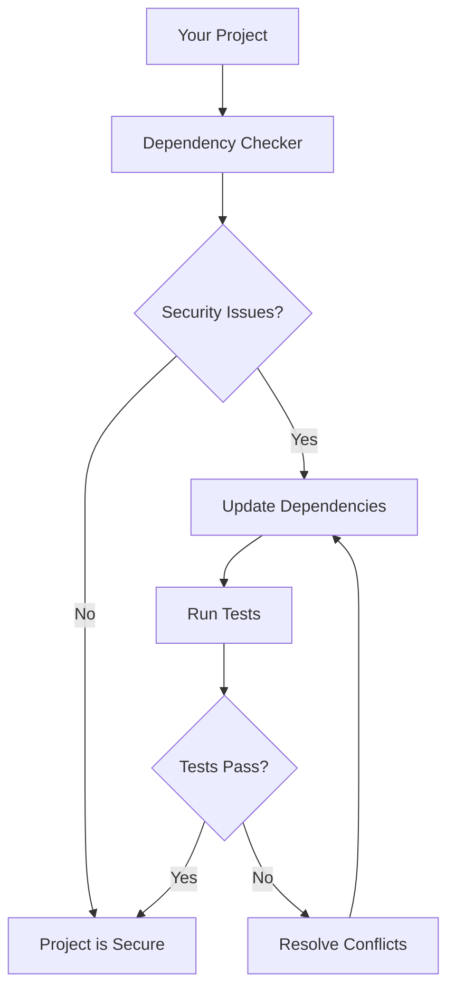
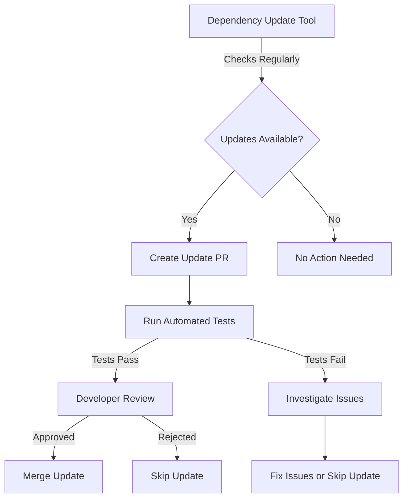

# Understanding Advanced Dependency Management

## 1. Advanced Dependency Resolution

Imagine you're building a big LEGO structure, but some pieces need different versions of the same block. That's similar to what happens in software development with dependencies!

### Key Points:
- Different parts of a project might need different versions of the same tool (dependency).
- Advanced dependency resolution helps manage these conflicts.
- Package managers use clever strategies to make sure everything works together.

### Common Strategies:
1. **Nested Dependencies**: Install different versions in separate folders (like npm does).
2. **Flat Resolution**: Try to find a single version that works for everyone (like Yarn's flat mode).

### Diagram: Dependency Resolution Strategies

In this diagram:
- The left side shows nested dependencies, where different versions can coexist.
- The right side shows flat resolution, finding a compromise version that works for all.

## 2. Security in Dependency Management

When you use code from others, you need to make sure it's safe – just like you'd check if food from a potluck is okay to eat!

### Key Points:
- Using external code (dependencies) can introduce security risks.
- Regular security checks are crucial.
- There are tools to help identify and fix security issues.

### Common Security Issues:
1. Known vulnerabilities in dependencies
2. Malicious packages (code that deliberately does bad things)
3. Outdated dependencies with unfixed bugs

### Security Best Practices:
1. Regularly run security audits (like `npm audit`)
2. Keep dependencies updated
3. Use trusted sources for packages
4. Implement access controls for private packages

### Diagram: Security in Dependency Management

This diagram shows:
- The process of checking your project for security issues
- The cycle of updating, testing, and resolving conflicts to keep your project secure

## 3. Continuous Dependency Updates

Keeping your project's dependencies up-to-date is like regularly maintaining a car. It keeps everything running smoothly and safely!

### Key Points:
- Regular updates improve security and performance.
- Automated tools can help manage updates.
- It's important to balance staying current with maintaining stability.

### Continuous Update Process:
1. Automatically check for updates
2. Create update proposals (usually as pull requests)
3. Run tests to ensure updates don't break anything
4. Review and merge updates

### Tools for Continuous Updates:
- Dependabot
- Renovate
- Greenkeeper

### Diagram: Continuous Dependency Update Process

This diagram illustrates:
- The automated process of checking for and proposing updates
- The steps of testing and reviewing updates before they're applied

## Conclusion

Advanced dependency management is crucial for maintaining healthy, secure, and up-to-date software projects. By understanding dependency resolution, prioritizing security, and implementing continuous updates, developers can build more robust and reliable software.

Remember:
- Dependency resolution helps manage complex relationships between different parts of your code.
- Security in dependency management is about being vigilant and proactive in identifying and addressing potential risks.
- Continuous updates keep your project current, but always test thoroughly to maintain stability.
