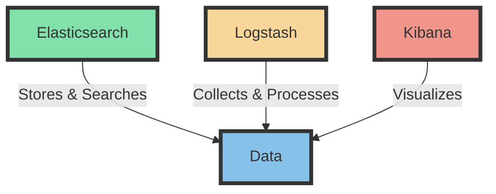
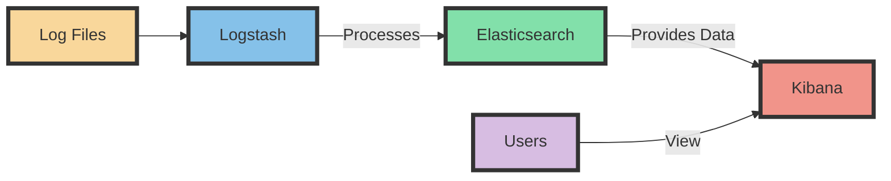

# Introduction to the ELK Stack

Hello, students! Today, we're going to learn about something really cool in the world of data analysis called the ELK stack. Don't worry if you've never heard of it before – we'll start from the very beginning!

## What is the ELK Stack?

The ELK stack is like a super-powered tool that helps us understand and make sense of lots and lots of information. It's especially useful for people who need to look at many computer logs (which are like diaries that computers keep about what they're doing).

ELK is actually made up of three different tools that work together:

1. **E**lasticsearch
2. **L**ogstash
3. **K**ibana

Let's break these down one by one:

### 1. Elasticsearch

Imagine you have a huge library with millions of books. Elasticsearch is like a super-fast librarian who can find any information you need in seconds. It stores all the data and helps us search through it really quickly.

### 2. Logstash

Logstash is like a helpful assistant that collects information from many different places. It can take messy data and tidy it up so that Elasticsearch can use it better. Think of it as someone who translates different languages into one that everyone can understand.

### 3. Kibana

Kibana is the artist of the group. It takes the information that Elasticsearch has stored and turns it into beautiful charts, graphs, and dashboards. It helps us see patterns and understand the data visually.

## How Does the ELK Stack Work?

Now, let's see how these three tools work together. Imagine we're running a big online store, and we want to understand how our website is doing.

1. **Collecting Data**: 
   - Our website creates logs (remember, those are like diaries) about who visits, what they look at, and what they buy.
   - Logstash collects all these logs from different parts of our website.

2. **Processing Data**:
   - Logstash then organizes this information. It might change dates into a standard format or categorize the types of actions users take.

3. **Storing Data**:
   - Logstash sends this organized data to Elasticsearch.
   - Elasticsearch stores it in a way that makes it easy to search and analyze.

4. **Analyzing and Visualizing**:
   - We use Kibana to create charts and graphs from this data.
   - We might make a graph showing how many people visit our site each day, or a chart of our most popular products.

Let's look at some diagrams to make this clearer!

## Diagram 1: ELK Stack Components

## Diagram 2: ELK Stack Workflow

## Why is the ELK Stack Useful?

1. **Quick Analysis**: It helps businesses understand what's happening right now, not just in the past.
2. **Problem Solving**: If something goes wrong with a website or app, ELK can help find the problem quickly.
3. **Decision Making**: By showing data in easy-to-understand ways, it helps people make better decisions.
4. **Flexibility**: It can be used for many different types of data, not just computer logs.

## Conclusion

The ELK stack is a powerful set of tools that work together to help us make sense of large amounts of data. By collecting, processing, storing, and visualizing information, it allows us to gain valuable insights that can help businesses run more smoothly and make better decisions.

Remember:
- Logstash collects and organizes the data
- Elasticsearch stores and searches the data
- Kibana helps us see and understand the data

Next time you use a website or app, think about all the data it might be generating, and how tools like the ELK stack could be helping to make your experience better!
