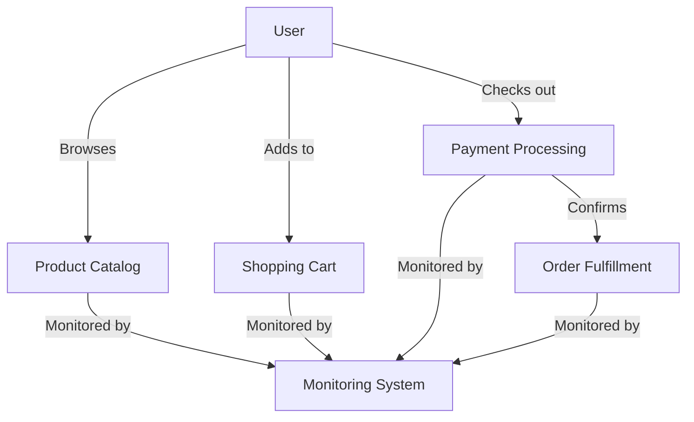
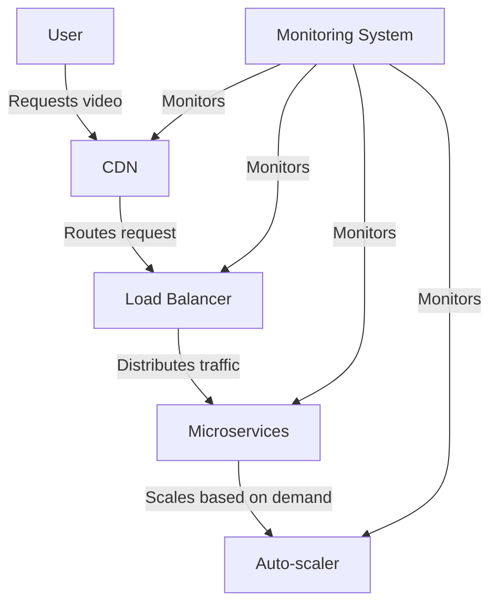
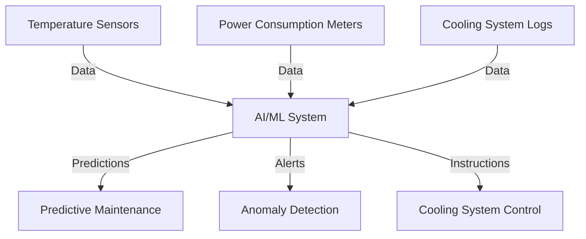
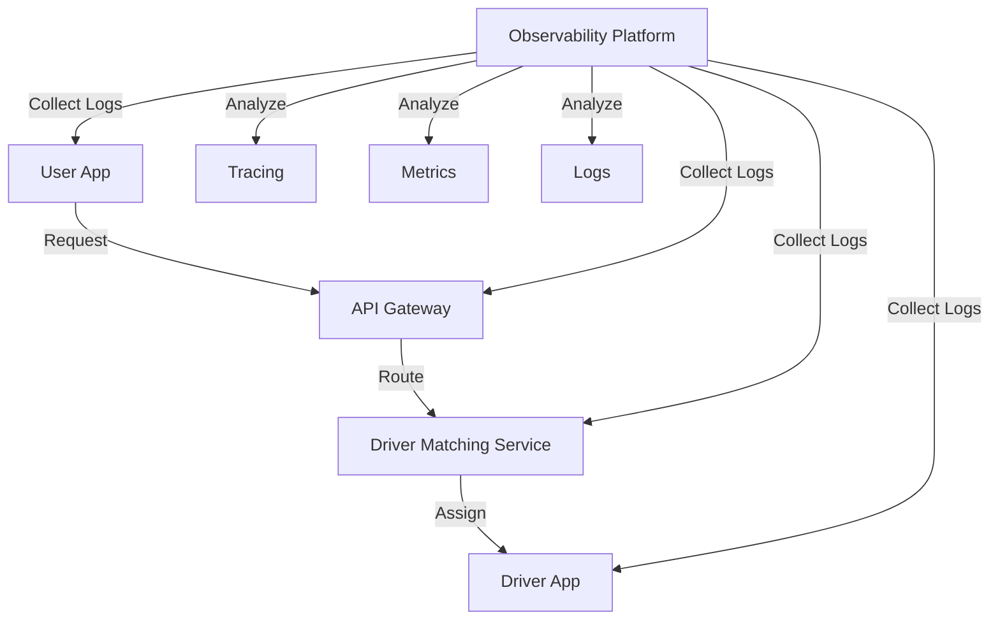

# Modern Infrastructure Monitoring: A Comprehensive Guide for Beginners

## Table of Contents
1. [Introduction](#introduction)
2. [Distributed Systems Monitoring](#distributed-systems-monitoring)
3. [Cloud-Native Monitoring](#cloud-native-monitoring)
4. [AI/ML in Infrastructure Monitoring](#aiml-in-infrastructure-monitoring)
5. [Observability Beyond Traditional Monitoring](#observability-beyond-traditional-monitoring)
6. [Challenges in Modern Infrastructure Monitoring](#challenges-in-modern-infrastructure-monitoring)
7. [Conclusion](#conclusion)

## Introduction

In today's digital landscape, businesses rely heavily on complex, interconnected systems to deliver services to their customers. As these systems grow in complexity, the need for effective monitoring becomes crucial. This guide aims to introduce you to modern infrastructure monitoring concepts, focusing on distributed systems, cloud-native environments, AI/ML applications, and the broader concept of observability.

## Distributed Systems Monitoring

### What are Distributed Systems?

Distributed systems are collections of independent computers that appear to users as a single coherent system. Examples include social media platforms, e-commerce websites, and streaming services.

### Monitoring Challenges in Distributed Systems

Monitoring distributed systems is complex due to:
1. Multiple points of failure
2. Network latency
3. Data consistency issues
4. Scale and complexity

### Real-life Example: E-commerce Platform

Imagine an e-commerce platform like Amazon. It consists of various services:
- Product catalog
- User accounts
- Shopping cart
- Payment processing
- Order fulfillment

Each of these services may run on different servers, potentially in different geographic locations.

### Monitoring Approach

To effectively monitor this distributed system:

1. **End-to-end Tracing**: Track a user's journey from browsing products to completing a purchase.
2. **Service-level Monitoring**: Monitor each service independently (e.g., response time of the product catalog service).
3. **Infrastructure Monitoring**: Keep track of the underlying hardware and network.

This diagram illustrates how each component of the e-commerce platform is monitored independently while also tracking the entire user journey.

## Cloud-Native Monitoring

### What is Cloud-Native?

Cloud-native refers to applications built and deployed using cloud computing principles. These applications are typically:
- Containerized
- Dynamically orchestrated
- Microservices-oriented

### Monitoring Challenges in Cloud-Native Environments

1. Dynamic nature of resources
2. Short-lived instances
3. Distributed tracing across microservices
4. Multi-cloud and hybrid cloud setups

### Real-life Example: Video Streaming Service

Consider a video streaming service like Netflix. It uses a cloud-native architecture to ensure scalability and reliability.

### Monitoring Approach

1. **Container Orchestration Monitoring**: Use tools like Prometheus to monitor Kubernetes clusters.
2. **Service Mesh Monitoring**: Implement solutions like Istio to monitor communication between microservices.
3. **Auto-scaling Metrics**: Monitor CPU and memory usage to trigger auto-scaling events.
4. **Content Delivery Network (CDN) Monitoring**: Track performance of video delivery across different regions.

This diagram shows how different components of a cloud-native video streaming service are monitored, including the CDN, load balancer, microservices, and auto-scaling mechanism.

## AI/ML in Infrastructure Monitoring

Artificial Intelligence (AI) and Machine Learning (ML) are revolutionizing infrastructure monitoring by:
1. Detecting anomalies
2. Predicting failures
3. Automating root cause analysis
4. Optimizing resource allocation

### Real-life Example: Data Center Cooling

Imagine a large data center that needs to maintain optimal temperature for server performance and energy efficiency.

### AI/ML Monitoring Approach

1. **Predictive Maintenance**: ML models predict when cooling systems might fail based on historical data.
2. **Anomaly Detection**: AI algorithms identify unusual patterns in temperature or power consumption.
3. **Automated Optimization**: ML models adjust cooling systems in real-time for optimal efficiency.

This diagram illustrates how an AI/ML system processes data from various sources to predict maintenance needs, detect anomalies, and optimize cooling system performance.

## Observability Beyond Traditional Monitoring

Observability extends traditional monitoring by focusing on understanding the internal state of a system based on its external outputs.

### Key Components of Observability

1. **Logs**: Detailed records of events within the system
2. **Metrics**: Quantitative measurements of system performance
3. **Traces**: Records of requests as they flow through the system

### Real-life Example: Ride-sharing Application

Consider a ride-sharing app like Uber. Observability is crucial for understanding and improving the user experience.

### Observability Approach

1. **User Journey Tracing**: Follow a ride request from the user's app through various microservices.
2. **Performance Metrics**: Monitor response times, success rates, and resource utilization.
3. **Error Logging**: Capture and analyze any errors or exceptions.
4. **Business Metrics**: Track key performance indicators like completed rides and user satisfaction.

This diagram shows how an observability platform collects data from various components of a ride-sharing application and provides insights through tracing, metrics, and log analysis.

## Challenges in Modern Infrastructure Monitoring

1. **Data Volume**: Managing and analyzing vast amounts of monitoring data.
2. **Tool Sprawl**: Integrating multiple monitoring tools and avoiding information silos.
3. **Alert Fatigue**: Balancing between necessary alerts and overwhelming noise.
4. **Security and Compliance**: Ensuring monitoring practices adhere to data protection regulations.
5. **Skill Gap**: Training teams to effectively use advanced monitoring and observability tools.

### Addressing These Challenges

1. Implement data retention and aggregation strategies
2. Adopt integrated monitoring platforms
3. Use AI for intelligent alerting and noise reduction
4. Implement robust access controls and data encryption
5. Invest in continuous learning and development for your team

## Conclusion

Modern infrastructure monitoring has evolved significantly to keep pace with the complexities of distributed systems, cloud-native architectures, and the need for deeper insights. By embracing these advanced monitoring concepts and tools, organizations can ensure better performance, reliability, and user experience for their digital services.

Remember, effective monitoring is not just about collecting data, but about gaining actionable insights that drive continuous improvement in your systems and processes.
