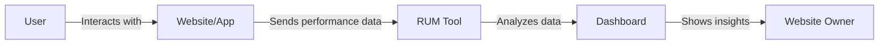
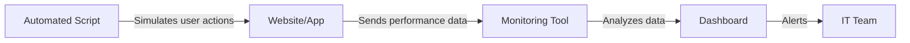
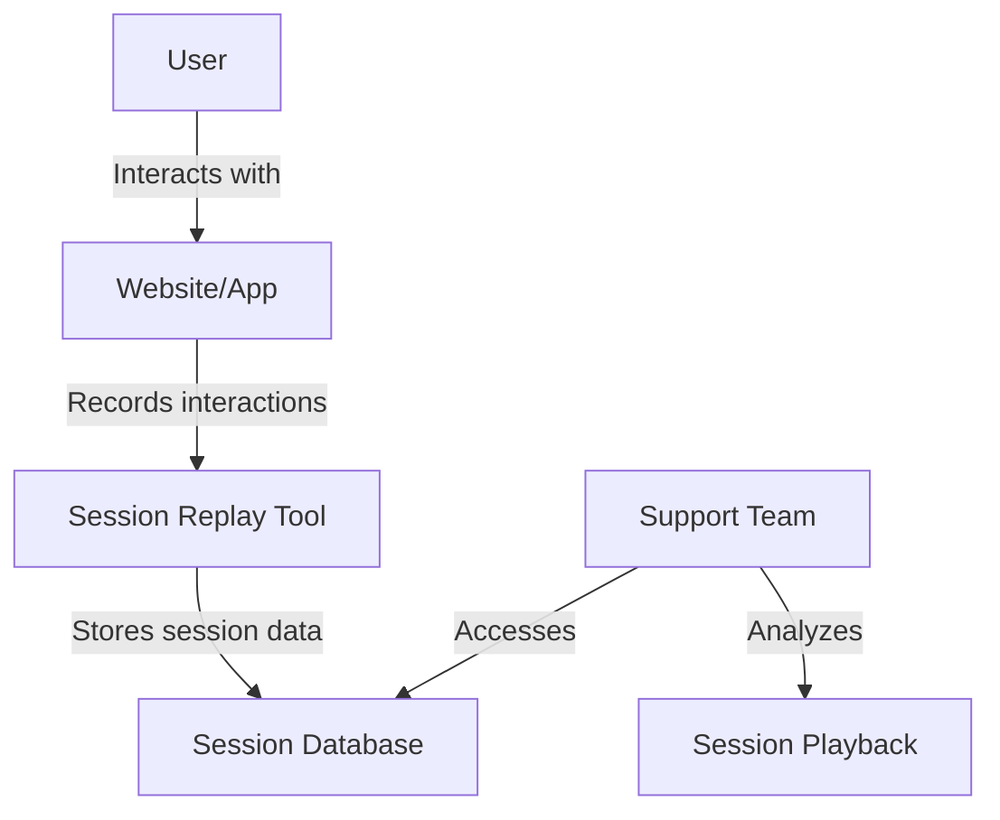

# A Beginner's Guide to Web Application Monitoring Techniques

## Introduction

In the world of web development and operations, monitoring is crucial for ensuring optimal performance, user satisfaction, and quick issue resolution. This guide introduces three key monitoring techniques: Real User Monitoring (RUM), Synthetic Monitoring, and Session Replay Monitoring. Each technique offers unique insights and benefits for understanding and improving your web application's performance and user experience.

## 1. Real User Monitoring (RUM)

### What is Real User Monitoring?

Real User Monitoring (RUM) is a technique that captures and analyzes data from actual users interacting with your website or application in real-time. It provides insights into how your application performs in the wild, across different devices, browsers, and network conditions.

### How RUM Works

1. Data Collection: JavaScript snippets embedded in your web pages collect performance metrics and user interactions.
2. Data Transmission: This data is sent to a RUM tool for processing.
3. Analysis: The RUM tool analyzes the data to provide insights on performance, user behavior, and potential issues.
4. Reporting: Results are displayed in dashboards for easy interpretation by developers and stakeholders.

### Real-Life Example

Imagine you run an e-commerce website. RUM would track:
- How long it takes for your product pages to load for different users
- How quickly users can add items to their cart
- The smoothness of the checkout process
- Any errors or crashes experienced by users

This data is collected from real customers using your site, giving you a true picture of the user experience.

### RUM Diagram

### Benefits of RUM

- Provides data on actual user experiences
- Helps identify issues affecting real users
- Useful for understanding performance across different devices, browsers, and locations
- Assists in prioritizing optimizations based on real user impact

## 2. Synthetic Monitoring

### What is Synthetic Monitoring?

Synthetic Monitoring involves simulating user interactions with your website or application using automated scripts. This allows you to proactively test performance and functionality without relying on real user traffic.

### How Synthetic Monitoring Works

1. Script Creation: Developers create scripts that mimic user actions (e.g., logging in, navigating pages, submitting forms).
2. Scheduled Execution: These scripts are run at regular intervals from different locations.
3. Data Collection: Performance metrics and success/failure data are collected during each run.
4. Analysis and Alerting: Results are analyzed, and alerts are triggered if issues are detected.

### Real-Life Example

Consider a banking application. You could set up synthetic monitoring to:
- Automatically log in every 5 minutes
- Check account balances
- Perform a mock transaction

This would help you detect any issues with these critical functions before real users encounter them.

### Synthetic Monitoring Diagram

### Benefits of Synthetic Monitoring

- Allows proactive testing and monitoring
- Helps detect issues before they impact real users
- Useful for monitoring critical paths and SLAs (Service Level Agreements)
- Provides consistent, reproducible results for benchmarking

## 3. Session Replay Monitoring

### What is Session Replay Monitoring?

Session replay monitoring records and reproduces user sessions, allowing you to watch how users interact with your website or application. This helps in understanding user behavior and identifying usability issues.

### How Session Replay Monitoring Works

1. Data Capture: User interactions, including mouse movements, clicks, and form inputs, are recorded.
2. Session Storage: The recorded sessions are securely stored.
3. Replay: Support teams or analysts can play back these sessions to observe user behavior.
4. Analysis: Sessions can be analyzed to identify common issues or patterns in user behavior.

### Real-Life Example

Imagine a travel booking website. Session replay would allow you to:
- Watch recordings of how users navigate through your site
- See where they click and how they interact with various elements
- Observe how they fill out forms
- Identify where users might get stuck or confused in the booking process

### Session Replay Monitoring Diagram

### Benefits of Session Replay Monitoring

- Offers detailed insights into user behavior
- Helps identify usability issues and pain points
- Useful for troubleshooting specific user problems
- Aids in improving UX design based on actual user interactions

## Conclusion

Each of these monitoring techniques serves a different purpose and provides unique insights:

- Real User Monitoring gives you the real-world performance picture.
- Synthetic Monitoring allows for proactive testing and consistent benchmarking.
- Session Replay Monitoring helps you understand the "why" behind user actions and issues.

By combining these techniques, you can gain a comprehensive view of your application's performance and user experience, leading to better decision-making, faster problem resolution, and ultimately, a superior product for your users.

Remember, the key to effective monitoring is not just implementing these techniques, but also regularly analyzing the data they provide and taking action based on the insights gained.
