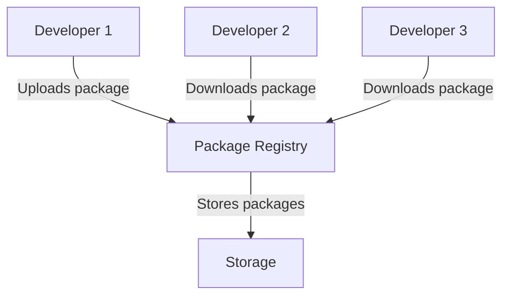
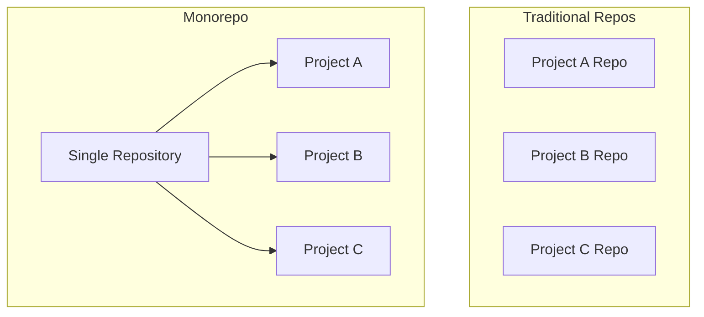
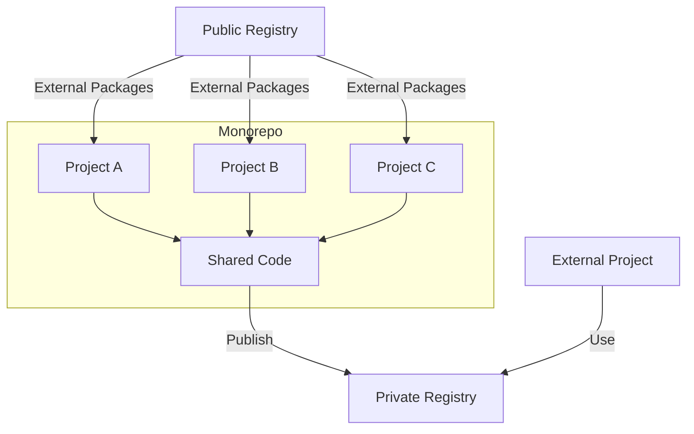

# Understanding Package Registries and Monorepo Management

## 1. What are Package Registries?

Imagine a giant library, but instead of books, it's filled with pieces of code. That's essentially what a package registry is! 

### Key Points:
- A package registry is a storage place for code packages.
- Developers can "borrow" code from these registries instead of writing everything from scratch.
- This saves time and allows developers to use well-tested code in their projects.

### Types of Package Registries:
1. **Public Registries**: Open to everyone (like a public library)
   - Examples: npm for JavaScript, PyPI for Python
2. **Private Registries**: For companies or teams to keep their code secure (like a private collection)

### Diagram: How Package Registries Work

In this diagram:
- Developer 1 creates a useful piece of code and uploads it to the registry.
- Developers 2 and 3 can then download and use this code in their own projects.

## 2. What is Monorepo Management?

A monorepo (short for "monolithic repository") is like having one big folder for multiple related projects.

### Key Points:
- Instead of having separate places for each project, everything is in one place.
- This makes it easier to share code between projects and make big changes across multiple projects at once.
- Special tools help manage these large repositories.

### Benefits of Monorepos:
1. Easier to share code between projects
2. Simpler to make changes that affect multiple projects
3. Keeps all related projects in sync

### Challenges:
1. Can become very large and complex
2. Requires special tools to manage effectively

### Diagram: Monorepo vs Traditional Repos

In this diagram:
- The left side shows traditional separate repositories for each project.
- The right side shows a monorepo with all projects in one repository.

## 3. How Package Registries and Monorepos Work Together

When using a monorepo, you can still use package registries:

1. You can use external packages from public registries in your monorepo projects.
2. You can create private packages within your monorepo and share them between your projects.
3. You can even set up a private registry for your monorepo, making it easier to manage shared code.

### Diagram: Monorepo with Package Registry

In this diagram:
- Projects A, B, and C are part of a monorepo and share some common code.
- The shared code can be published to a private registry.
- External projects can use this shared code from the private registry.
- The monorepo projects can also use packages from public registries.

## Conclusion

Package registries and monorepos are powerful tools that help developers manage and share code more efficiently. While they can seem complex at first, understanding these concepts can help you see how large-scale software projects are organized and maintained.
