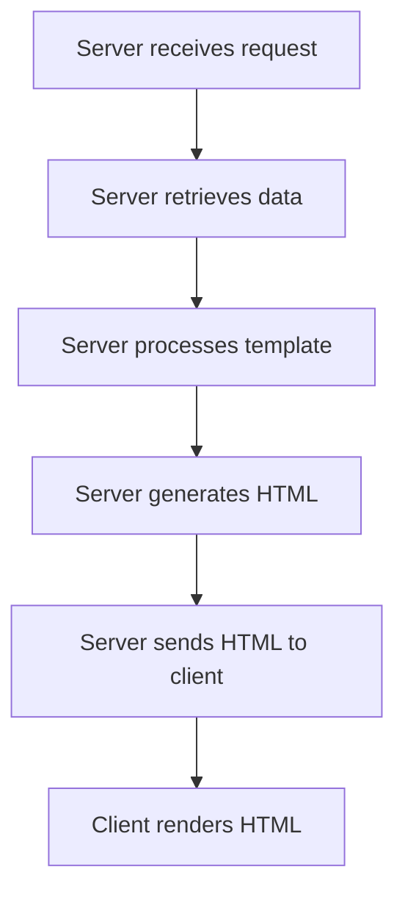
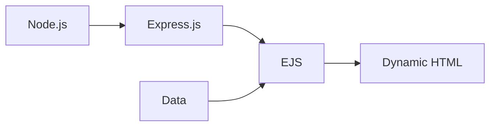
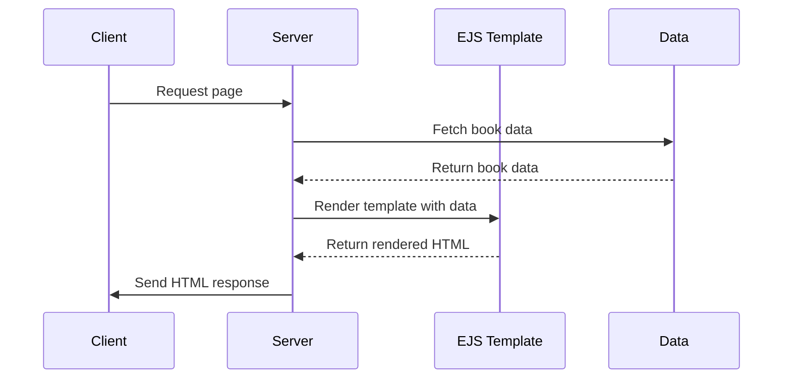

# Server-Side Templating and EJS Explanation

## What is Server-Side Templating?

Server-side templating is a technique used in web development to generate dynamic HTML content on the server before sending it to the client's browser. It allows developers to embed server-side code (like JavaScript in Node.js) directly into HTML templates, which are then processed on the server to produce the final HTML that is sent to the client.

### How Server-Side Templating Works

1. The server receives a request from the client.
2. The server retrieves necessary data (e.g., from a database).
3. The server processes a template file, inserting the data into placeholders.
4. The server generates the final HTML.
5. The server sends the generated HTML to the client.
6. The client's browser renders the HTML.

## What is EJS?

EJS (Embedded JavaScript) is a simple templating language that lets you generate HTML markup with plain JavaScript. It's a popular choice for server-side templating in Node.js applications.

### Key features of EJS:

1. Fast compilation and rendering
2. Simple syntax with plain JavaScript
3. Both server-side and client-side support
4. Static caching of intermediate JavaScript
5. Static caching of templates
6. Complies with the Express view system

## Why Use Server-Side Templating and EJS?

1. **Dynamic Content Generation**: Easily create dynamic web pages based on data from databases or other sources.
2. **Separation of Concerns**: Keep your HTML structure separate from your application logic.
3. **Code Reusability**: Create reusable templates and partials to maintain consistency across your site.
4. **Improved Performance**: Generate HTML on the server, reducing client-side processing.
5. **Security**: Sensitive logic and data processing occur on the server, not exposed to the client.

## Connection in the Project

In the bookstore project, Node.js and EJS are used together to create a dynamic website:

1. **Node.js** serves as the backend runtime, handling server logic and routing.
2. **Express.js** (a Node.js framework) is used to set up the web server and handle HTTP requests.
3. **EJS** is used as the templating engine to generate dynamic HTML based on data provided by the server.

## Project Workflow

1. The client requests a page (e.g., the home page or a specific book page).
2. The server receives the request and determines which route to use.
3. The server fetches the necessary data (in this case, book information).
4. The server calls the appropriate EJS template, passing the data.
5. EJS processes the template, inserting the data into the HTML structure.
6. The server sends the final HTML back to the client.
7. The client's browser renders the HTML, displaying the dynamic content.

## Key Components of the Project

1. **server.js**: The main Node.js file that sets up the Express server, defines routes, and handles requests.
2. **views/index.ejs**: The EJS template for the home page, displaying the list of books.
3. **views/book.ejs**: The EJS template for individual book pages.
4. **public/styles.css**: CSS file for styling the HTML output.

By using EJS templates, the project can easily display dynamic content (the list of books) without hardcoding the HTML. This makes it simple to update the book inventory or add new features without major changes to the HTML structure.
